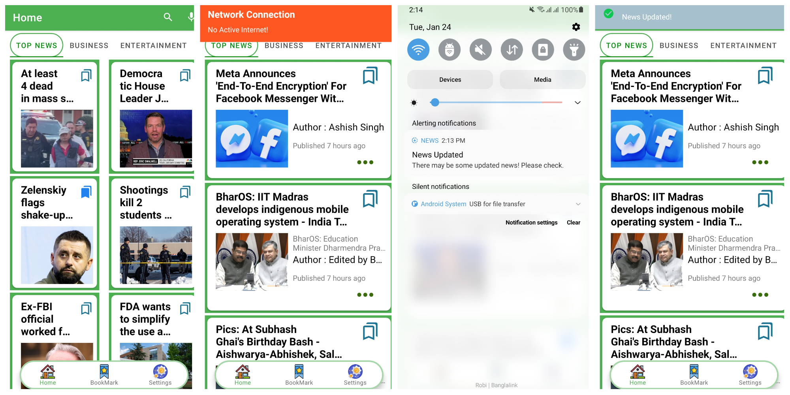

# Android_Asraful_MidTermProject


## Android News App With Retrofit


## Features

### Categories

* Top News
* Business
* Sports
* Science
* Technology
* Entertainment
* Health

### Components
1. Navigation 
2. Room DB
3. Retrofit
4. APi Service
5. Custom Cookie Bar
6. Tab Layout
7. View Pager 2


## Description
This project is a news app that uses API technology to collect and display the latest news articles from various sources. The app has a clean and user-friendly interface that allows users to easily flip through the latest headlines and read full articles. Users can also customize their news feed by choosing specific topics and sources of interest. The app uses API calls to collect news articles from multiple sources, giving users access to different news and perspectives. The app also includes features that allow users to share articles on social media platforms. Overall, this project aims to provide users with a convenient and comprehensive news experience using API technology. Moreover, I have tried to handle internet permission and connection exception. Sync data from api with an interval of 5 hours also successfully done.

#Main View


#Search 


#Full View


#Settings 


#Exception Handling 




## Link
https://github.com/asrafulalam78

```
let message = 'Wishing a sound user experience';
alert(message);
```
